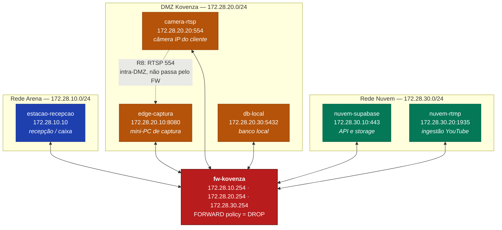
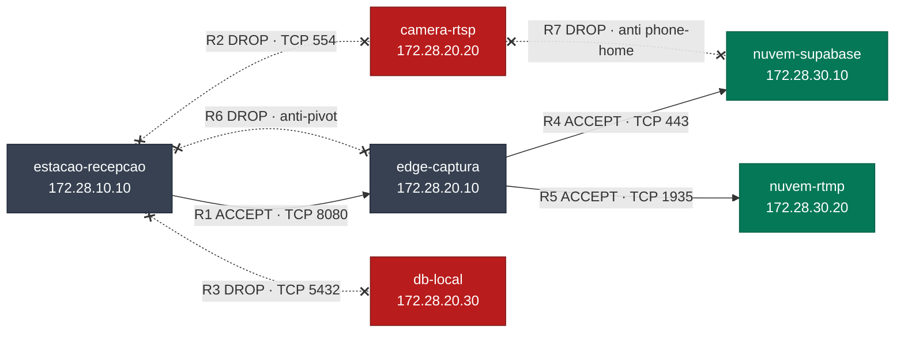
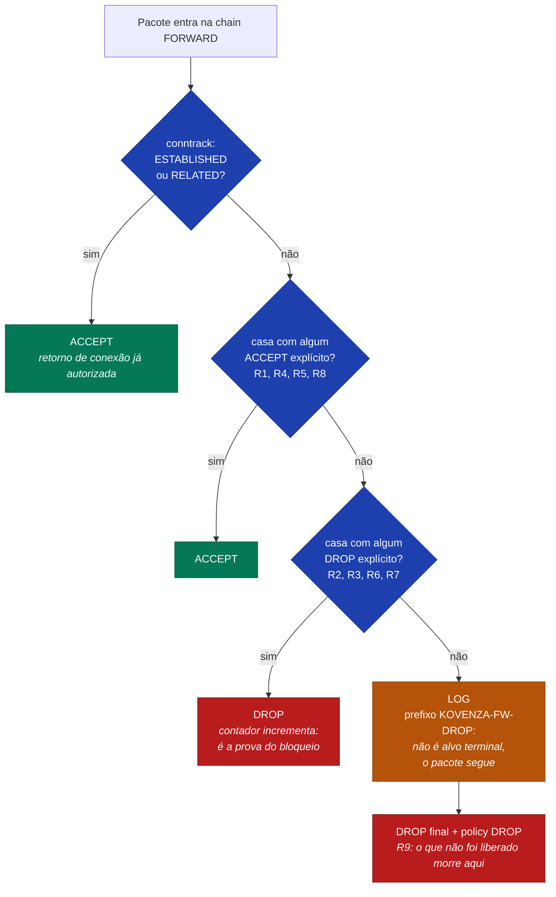

# Diagrama da topologia

Kovenza Sports — segmentação da rede de uma arena parceira.
Os diagramas abaixo renderizam diretamente no GitHub.

---

## 1. Topologia das três zonas

O `fw-kovenza` é o **único** contêiner presente em mais de uma rede. Toda
comunicação entre zonas atravessa obrigatoriamente a chain `FORWARD` dele.

A seta pontilhada (R8) registra a única exceção: `camera-rtsp` e `edge-captura`
estão na mesma bridge, logo esse tráfego é entregue direto pelo Docker e não é
filtrado. Ver [RELATORIO.md, seção 4.4](RELATORIO.md#44-limitação-conhecida-a-regra-r8-não-é-aplicável-nesta-topologia).

---

## 2. Fluxos autorizados e bloqueados

Linha cheia = `ACCEPT`. Linha pontilhada com `x` = `DROP`.

---

## 3. Caminho de um pacote na chain FORWARD

A ordem é o que faz a política funcionar: o Netfilter avalia de cima para baixo
e para no primeiro alvo terminal.

Se um `ACCEPT` amplo estivesse antes de um `DROP` específico, o `DROP` nunca
seria alcançado. É por isso que a ordem no
[firewall/entrypoint.sh](../firewall/entrypoint.sh) é fixa:
**conntrack → ACCEPTs → DROPs → LOG**.

---

## 4. Por que existem rotas estáticas

```mermaid
flowchart TD
    subgraph SEM["Sem rota estática (padrão do Docker)"]
        A1["estacao-recepcao<br/>destino 172.28.20.10"] --> A2{"tabela de<br/>roteamento"}
        A2 -->|"única opção:<br/>default via 172.28.10.1"| A3["gateway da bridge<br/>no host Docker"]
        A3 --> A4["DOCKER-ISOLATION<br/>descarta"]
        A4 --> A5["falha — e o firewall<br/>nunca viu o pacote"]
    end

    subgraph COM["Com rota estática (este projeto)"]
        B1["estacao-recepcao<br/>destino 172.28.20.10"] --> B2{"tabela de<br/>roteamento"}
        B2 -->|"172.28.20.0/24 via 172.28.10.254<br/><b>mais específica que a default</b>"| B3["fw-kovenza"]
        B3 --> B4["chain FORWARD<br/>avalia a matriz"]
        B4 --> B5["decisão por regra,<br/>com contador"]
    end

    classDef bad fill:#b91c1c,stroke:#7f1d1d,color:#fff
    classDef ok fill:#047857,stroke:#065f46,color:#fff
    classDef dec fill:#1e40af,stroke:#1e3a8a,color:#fff

    class A4,A5 bad
    class B3,B4,B5 ok
    class A2,B2 dec
```

Os dois caminhos **falham igual no terminal** para um teste negativo — e só um
deles é segurança de verdade. É exatamente essa diferença que o
[scripts/testes-negativos.sh](../scripts/testes-negativos.sh) mede, zerando os
contadores antes de cada teste e exigindo que a regra de `DROP` registre o
pacote.
